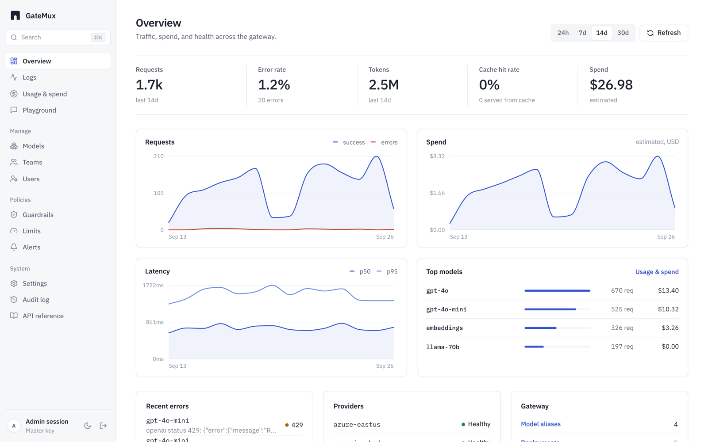
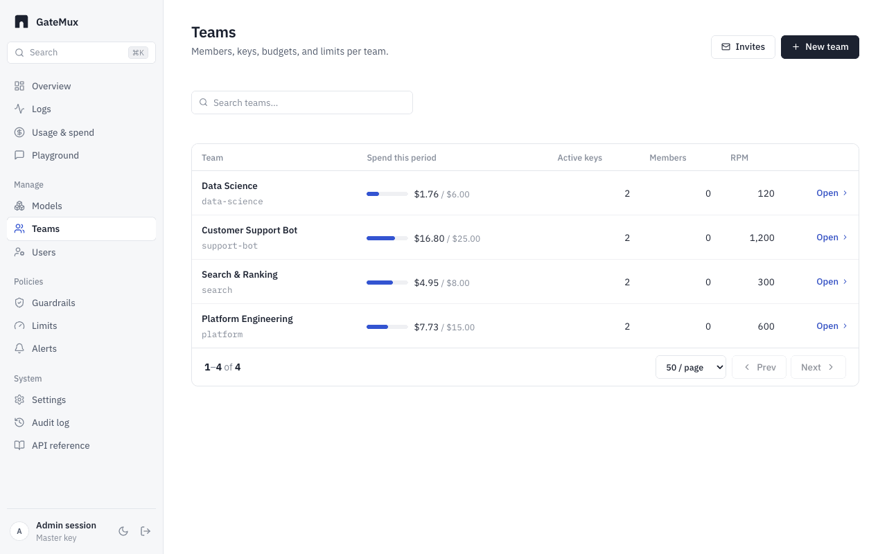
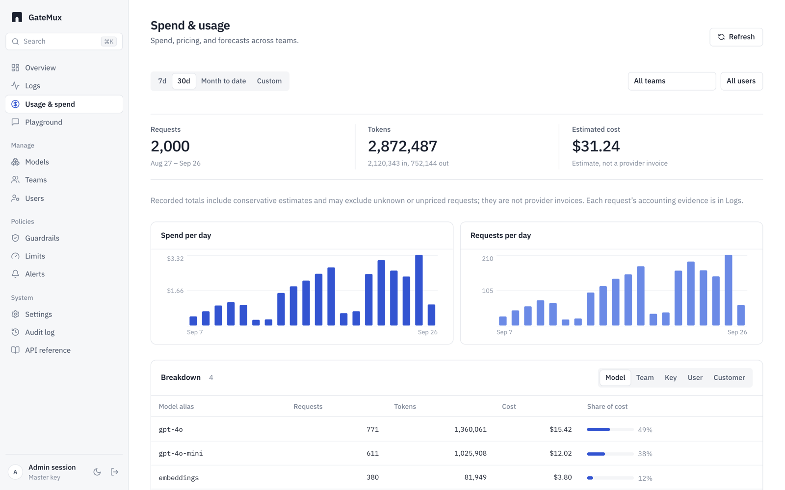
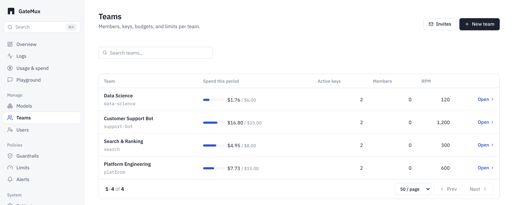
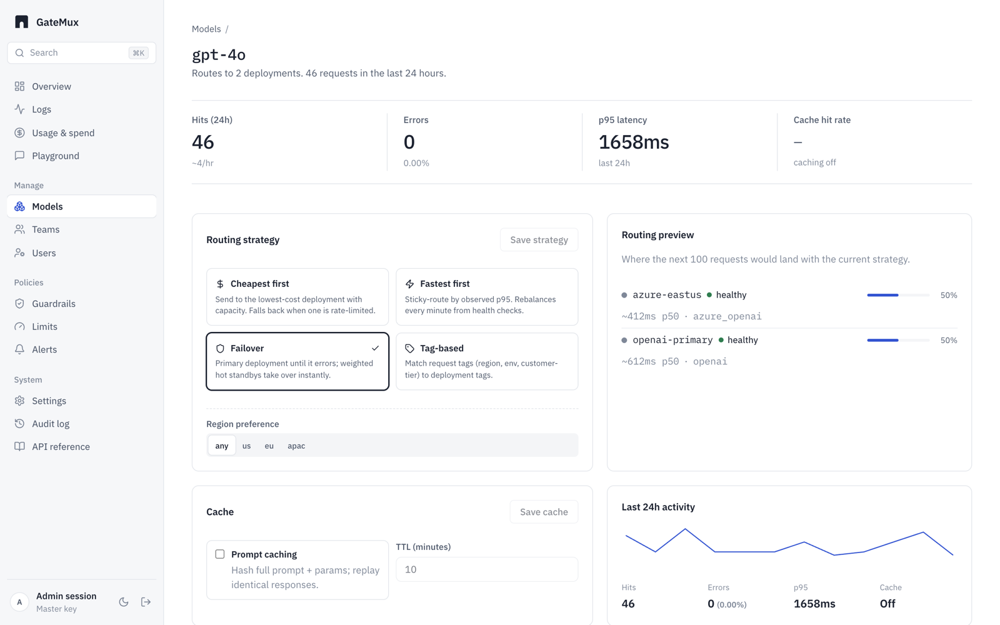
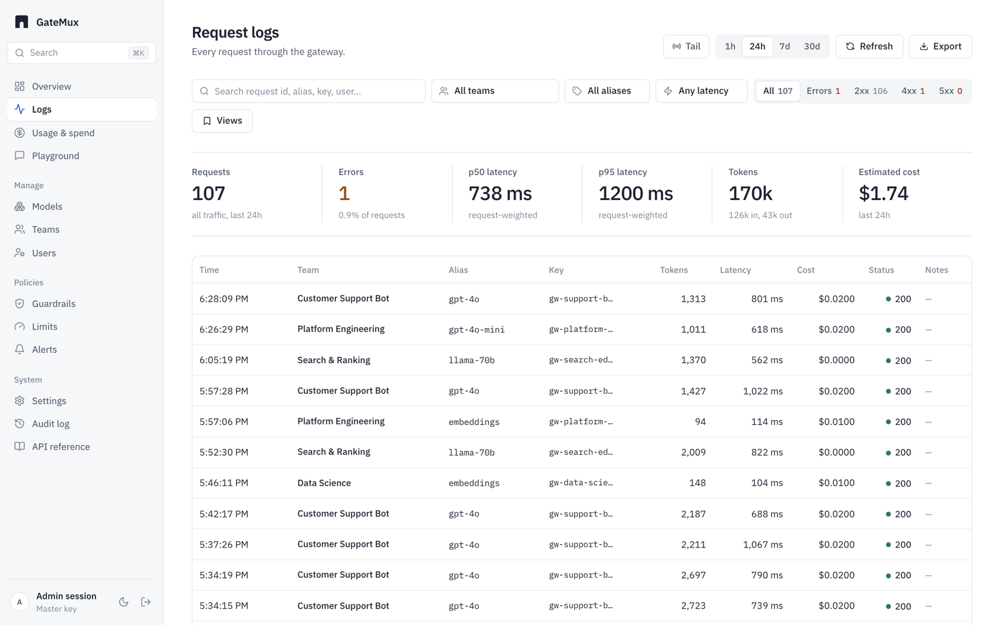

<div align="center">

# GateMux

**The open-source LLM gateway with teams, budgets and SSO built in — not an enterprise upsell.**

One OpenAI-compatible API in front of OpenAI, Anthropic, Azure OpenAI, vLLM and Ollama,
with virtual keys, per-team spend limits, rate limits, routing and fallback.
A single Go binary with its own admin console.

[](https://github.com/gatemux-dev/gatemux/actions/workflows/ci.yml) [](https://github.com/gatemux-dev/gatemux/releases) [](go.mod) [](LICENSE)

[Quickstart](#quickstart) · [Features](#features) · [Docs](#documentation) · [Status](#status) · [Contributing](CONTRIBUTING.md)

</div>

<picture>
  <source media="(prefers-color-scheme: dark)" srcset="docs/images/overview-dark.png">
  
</picture>

## Why GateMux

Most LLM gateways make routing free and charge for governance. GateMux ships
the governance in the MIT-licensed core:

- **Teams and virtual keys.** Give every team, service and customer its own key
  instead of sharing one provider secret. Rotate, pause or expire keys without
  touching the provider account.
- **Budgets that are enforced.** Monthly or daily spend caps per team, user, key
  and customer. Requests are admitted against a reservation before they reach
  the provider, so a runaway script stops at the cap instead of after the invoice.
- **Access control.** Admin, manager and member roles, email/password and OIDC
  sign-in with claim-based role and team mapping, an audit log of admin actions.
- **One binary.** A Go server with the console embedded, Postgres for state,
  Redis for distributed limits. No Python runtime, no hosted control plane.



## Quickstart

Requirements: Docker with Compose, and OpenSSL to generate an admin secret.

```sh
git clone https://github.com/gatemux-dev/gatemux.git && cd gatemux
export GATEMUX_ADMIN_KEY="$(openssl rand -hex 32)"
docker compose -f deploy/docker/docker-compose.yml up -d --build
```

Open **http://localhost:4000**, choose **Emergency / break-glass admin key** and
paste the value of `GATEMUX_ADMIN_KEY`. There is no default admin key; save it in
your password manager if you want to reuse it.

In the console, create a team and issue a virtual key. Applications use the
virtual key, never the admin key:

```sh
curl http://localhost:4000/v1/chat/completions \
  -H "Authorization: Bearer $GATEMUX_VIRTUAL_KEY" \
  -H "Content-Type: application/json" \
  -d '{"model":"gpt-4","messages":[{"role":"user","content":"Hello"}]}'
```

Existing OpenAI SDKs work unchanged: point `base_url` at `http://localhost:4000/v1`
and use the virtual key as the API key.

<details>
<summary>Provider keys, ports and stopping the stack</summary>

The console works without a paid provider key. Inference needs a real provider:
set `OPENAI_API_KEY` before starting to use the sample `gpt-4` alias, or add your
own deployment and alias in the console. Provider calls may incur charges, and
the sample alias is only a local example; check that your provider account
supports its upstream model. For local models, see the [vLLM guide](docs/vllm.md).

All published ports bind to loopback: gateway 4000, Postgres 55432, Redis 56379.
Set `GATEMUX_PORT=4001` if the gateway port is busy. Development SSO is opt-in;
see [deployment](docs/deploy.md). This stack is not an internet-facing production
configuration.

Stop without deleting database state:

```sh
docker compose -f deploy/docker/docker-compose.yml stop
```

Upgrading an existing installation? Read the [rename upgrade guide](docs/rename-upgrade.md)
first to preserve your database volume and shared Redis namespace.

</details>

## Features

| | |
|---|---|
| **API** | OpenAI-compatible chat completions (including streaming), embeddings and model listing; unknown fields forwarded to compatible backends; OpenAPI document and offline API reference at `/docs` |
| **Providers** | OpenAI, Anthropic, Azure OpenAI, and any OpenAI-compatible endpoint including vLLM and Ollama |
| **Access** | Teams, users, service accounts, virtual keys with expiry, rotation and model allowlists; admin/manager/member roles; password and OIDC sign-in |
| **Cost control** | Per-team, user, key and customer budgets with reservation-based admission; RPM/TPM rate limits; distributed concurrency caps |
| **Reliability** | Routing strategies, retries before the first byte, ordered fallback, per-attempt timeouts and circuit breakers |
| **Visibility** | Request logs, spend and usage reports with CSV export, provider health, audit log |
| **Guardrails** | Literal-term chat guardrails per team or model alias |
| **Deploy** | Docker Compose, Helm chart, multi-arch container image |

The [supported surface](docs/supported-surface.md) lists which of these are
stable, beta or experimental.

<table>
  <tr>
    <td width="50%">
      <picture>
        <source media="(prefers-color-scheme: dark)" srcset="docs/images/spend-dark.png">
        
      </picture>
      <p align="center"><b>Spend by team, model, key and customer</b></p>
    </td>
    <td width="50%">
      <picture>
        <source media="(prefers-color-scheme: dark)" srcset="docs/images/teams-dark.png">
        
      </picture>
      <p align="center"><b>Budgets and rate limits per team</b></p>
    </td>
  </tr>
  <tr>
    <td width="50%">
      <picture>
        <source media="(prefers-color-scheme: dark)" srcset="docs/images/routing-dark.png">
        
      </picture>
      <p align="center"><b>Routing and failover per model alias</b></p>
    </td>
    <td width="50%">
      <picture>
        <source media="(prefers-color-scheme: dark)" srcset="docs/images/logs-dark.png">
        
      </picture>
      <p align="center"><b>Every request with tokens, latency and cost</b></p>
    </td>
  </tr>
</table>

## Status

GateMux is a **public alpha**: ready for local evaluation and controlled pilots,
not yet a production-readiness promise. APIs and configuration may change.
Broad provider coverage, production-scale capacity and multi-host recovery are
not fully qualified, and no performance-leadership claim is made. Read the
[alpha limitations and roadmap](docs/public-alpha.md) before sending real traffic.

## Documentation

- [Supported surface](docs/supported-surface.md)
- [Alpha limitations and roadmap](docs/public-alpha.md)
- [Deployment, security and upgrades](docs/deploy.md)
- [API compatibility](docs/api-compatibility.md)
- [Configuration example](examples/config.yaml)
- [vLLM example and setup](docs/vllm.md)
- [Contributing and tests](CONTRIBUTING.md)
- [Security reporting](SECURITY.md)
- [Changelog](CHANGELOG.md)

## Contributing

Issues labelled [good first issue](https://github.com/gatemux-dev/gatemux/issues?q=is%3Aopen+label%3A%22good+first+issue%22)
are scoped for a first contribution. See [CONTRIBUTING.md](CONTRIBUTING.md) for
the development setup and test commands.

If GateMux is useful to you, a star helps other people find it.

## License

[MIT](LICENSE). Contributors must have the rights to submit their work.
